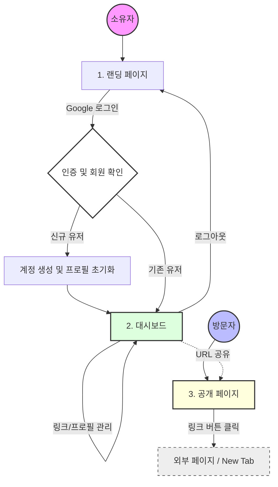
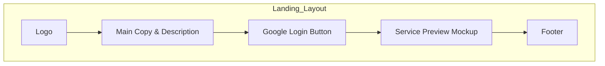
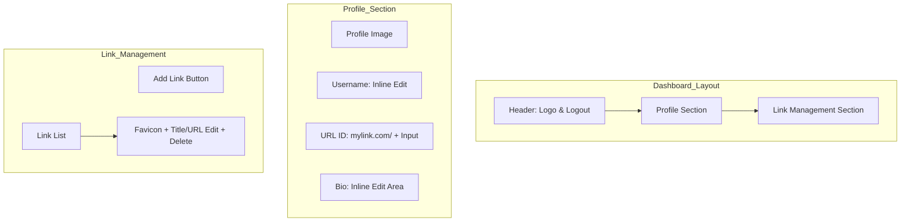
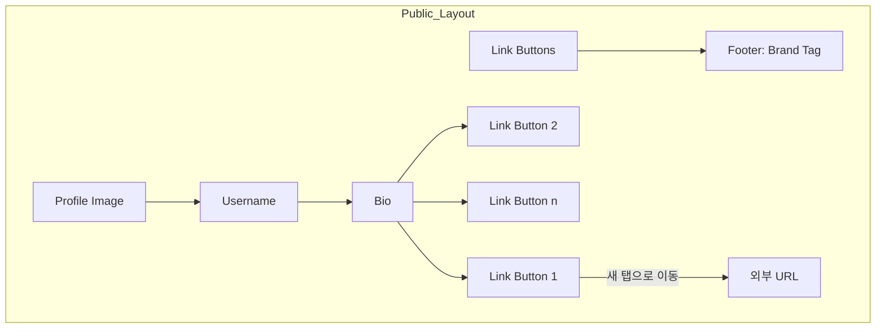

# 마이링크 (My Link) - 와이어프레임 (Wireframes)

이 문서는 '마이링크' 서비스의 주요 화면 구조 및 페이지 간 흐름을 정의합니다. 모든 화면은 모바일 퍼스트(Mobile-First) 디자인을 따릅니다.

## 0. 페이지 흐름도 (Page Flow)

서비스의 주요 사용자별 이동 경로를 나타냅니다.



---

## 1. 랜딩 페이지 (Landing Page)

비로그인 사용자가 처음 마주하는 페이지로, 서비스 소개와 구글 로그인 기능을 제공합니다.

```text
+---------------------------------------+
|  My Link                              | <--- 로고
+---------------------------------------+
|                                       |
|          Welcome to My Link           | <--- 메인 카피
|                                       |
|     나만의 링크들을 하나의 페이지로   | <--- 서비스 설명
|      깔끔하게 정리하고 공유하세요.    |
|                                       |
|       +-----------------------+       |
|       | [G] Google로 시작하기 |       | <--- 구글 로그인 버튼
|       +-----------------------+       |
|                                       |
|                                       |
|          [ 서비스 미리보기 ]          | <--- 서비스 목업 이미지
|          [     Mockup      ]          |
|                                       |
+---------------------------------------+
|          Made with My Link            |
+---------------------------------------+
```

### 주요 컴포넌트 구조 (Mermaid)


---

## 2. 대시보드 (Dashboard - Owner)

사용자가 자신의 프로필과 링크를 관리하는 화면입니다.

```text
+---------------------------------------+
|  My Link               [ Logout ]     | <--- 헤더 (상단 고정)
+---------------------------------------+
|                                       |
|       +-----------------------+       |
|       |       [ Profile ]     |       | <--- 프로필 이미지 (고정)
|       +-----------------------+       |
|                                       |
|       [ 닉네임 (Username) ]           | <--- 클릭 시 인라인 편집
|                                       |
|   mylink.com/ [ URL ID      ]         | <--- 고정 주소 + 입력창
|                                       |
|       [ 한 줄 소개 (Bio)  ]           | <--- 클릭 시 인라인 편집
|                                       |
+---------------------------------------+
|                                       |
|       [ + 새 링크 추가 ]              | <--- 링크 추가 버튼
|                                       |
+---------------------------------------+
|                                       |
|  +---------------------------------+  |
|  | [Icon]  [ 제목 (Title) ]    [X] |  | <--- 링크 아이템 (편집/삭제)
|  |         [ URL          ]        |  |
|  +---------------------------------+  |
|                                       |
|  +---------------------------------+  |
|  | [Icon]  [ 제목 (Title) ]    [X] |  |
|  |         [ URL          ]        |  |
|  +---------------------------------+  |
|                                       |
+---------------------------------------+
```

### 주요 컴포넌트 구조 (Mermaid)


---

## 3. 공개 페이지 (Public Page - Visitor)

방문자가 링크를 확인하고 클릭하는 화면입니다.

```text
+---------------------------------------+
|                                       |
|                                       |
|       +-----------------------+       |
|       |       [ Profile ]     |       |
|       +-----------------------+       |
|                                       |
|            닉네임 (Username)          |
|                                       |
|             한 줄 소개 (Bio)          |
|                                       |
|                                       |
+---------------------------------------+
|                                       |
|  +---------------------------------+  |
|  | [Icon]       Link Title         |  | <--- 링크 클릭 시 외부 이동
|  +---------------------------------+  |
|                                       |
|  +---------------------------------+  |
|  | [Icon]       Link Title         |  |
|  +---------------------------------+  |
|                                       |
|  +---------------------------------+  |
|  | [Icon]       Link Title         |  |
|  +---------------------------------+  |
|                                       |
+---------------------------------------+
|          Made with My Link            |
+---------------------------------------+
```

### 주요 컴포넌트 구조 (Mermaid)


---
마지막 업데이트: 2026-04-27
